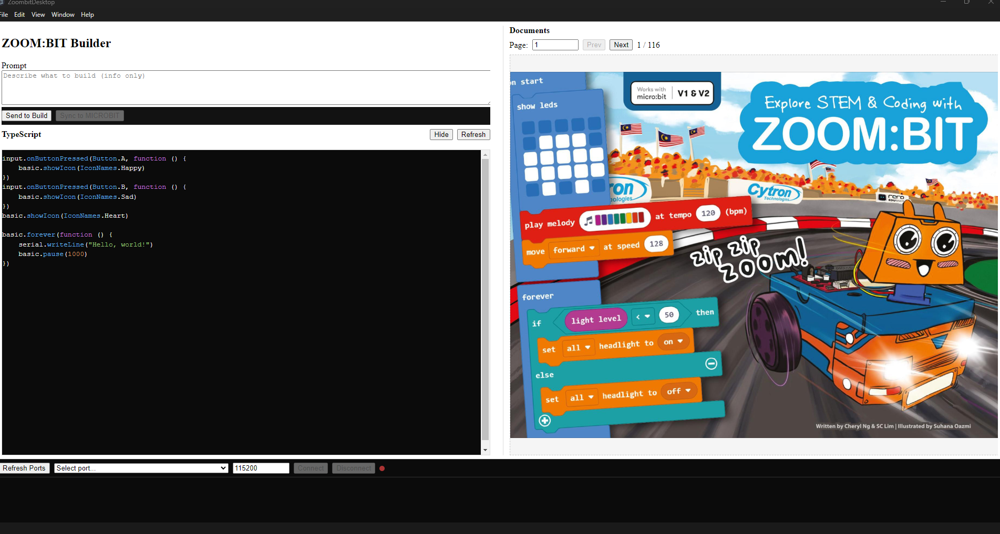

# zoombit-microbit-lllm



A small collection of tools, firmware and desktop UI for the Zoombit micro:bit robot project. This repository contains disassembly artifacts, a PXT (MakeCode) project, helper scripts and an Electron desktop UI used while developing and analyzing the Zoombit firmware.

## Contents

- `microbit-rekabit-robot.bin`, `*.hex`, `*.bin` and `*_disasm.asm` — firmware binary and disassembly outputs used for analysis.
- `pxt-zoombit/` — MakeCode/PXT project for Zoombit (source TypeScript, `built/` contains prebuilt firmware hex/asm artifacts).
- `zoombit-desktop/` — Electron/Angular desktop UI for interacting with Zoombit.
- `scripts/` — convenience scripts: `start-all.ps1` (Windows PowerShell) and `start-all.sh` (Unix shell) to start services/dev tools used during development.
- analysis scripts: `disasm_microbit.py`, `strings_report.txt`, `strings_funcs_report.py` and other helper scripts used to inspect firmware.

## Quick start (Windows PowerShell)

Prerequisites

- Node.js (LTS) and npm
- Python 3 (for some analysis scripts)
- Git

Run the project helper script (PowerShell):

```powershell
# allow script for this session then run
Set-ExecutionPolicy -Scope Process -ExecutionPolicy Bypass;
.\scripts\start-all.ps1
```

If you'd rather run the script without changing execution policy in the session:

```powershell
powershell -ExecutionPolicy Bypass -File .\scripts\start-all.ps1
```

Project manually

- PXT / MakeCode (development):
  - cd into `pxt-zoombit`
  - `npm install`
  - Use the PXT/Micro:bit tooling there to build and flash; `built/` contains generated hex files.

- Desktop UI:
  - cd into `zoombit-desktop`
  - `npm install`
  - `npm start` (runs the Electron/Angular app)

- Analysis scripts (disassembly, string extraction):
  - Run `python disasm_microbit.py` or `python strings_funcs_report.py` as needed. These scripts operate on the `*.bin` and `*_disasm.asm` files present in the repo root.

## Useful files and locations

- `pxt-zoombit/built/` — prebuilt `binary.hex`, `mbcodal-binary.hex` and assembly outputs.
- `microbit-rekabit-robot_seg*.bin` and `*_disasm.asm` — segmented firmware and disassembly used during reverse engineering.
- `microbit-rekabit-robot.filtered.hex` — filtered firmware hex used in tooling.
- `scripts/start-all.ps1` and `scripts/start-all.sh` — helper scripts to start dev servers and watchers.

## Contributing

- Fork and submit pull requests.
- Keep edits to `pxt-zoombit/` and `zoombit-desktop/` self-contained where possible.
- If you update generated firmware, include the generated `hex`/`bin` into `pxt-zoombit/built/` or provide a clear build step in the PR description.

## License

See `pxt-zoombit/LICENSE` for the MakeCode/firmware license details. Other parts of the repo may carry their own licenses — check top-level files in each subfolder.

## Contact / Notes

This repo contains both source and reverse-engineering artifacts. Treat disassembly and analysis files as research artifacts. If you need specific help building firmware, running the desktop app, or reproducing a disassembly step, open an issue with the exact OS, Node/Python versions and the commands you ran.

---

Generated on: 2025-08-18
